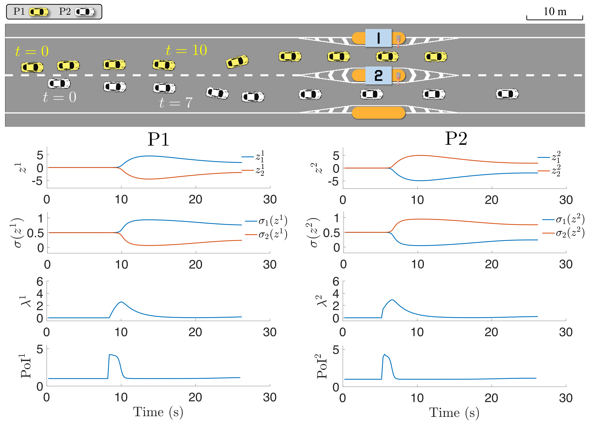

# Emergent Coordination through Game-Induced Nonlinear Opinion Dynamics


[![License][license-shield]][license-url]
[](https://www.python.org/downloads/)


<!-- TABLE OF CONTENTS -->
<details open="open">
  <summary><h2 style="display: inline-block">Table of Contents</h2></summary>
  <ol>
    <li><a href="#about-the-project">About The Project</a></li>
    <li><a href="#dependencies">Dependencies</a></li>
    <li><a href="#example">Example</a></li>
    <li><a href="#license">License</a></li>
    <li><a href="#contact">Contact</a></li>
    <li><a href="#paper">Paper</a></li>
  </ol>
</details>


<!-- ABOUT THE PROJECT -->
## About The Project

This repository implements a receding-horizon planning framework for multi-agent emergent coordination tasks based on Game-Induced Nonlinear Opinion Dynamics (GiNOD), and contains a simulated toll station coordination example involving two autonomous vehicles.
The repo is primarily developed and maintained by [Haimin Hu](https://haiminhu.org/), a PhD student in the [Safe Robotics Lab](https://saferobotics.princeton.edu).

The ILQ Game implementation is inspired by David Fridovich-Keil's [ilqgames](https://github.com/HJReachability/ilqgames) and leverages [JAX](https://github.com/google/jax) for real-time computation performance based on automatic differentiation and just-in-time (JIT) compilation.


## Dependencies

This repo depends on the following packages:
1. jax=0.3.17
2. jaxlib=0.3.15
3. numpy=1.21.5
4. python=3.8.13
5. yaml=0.2.5


## Example
The following scripts reproduce the results in our paper.

1. L0-QMDP with homogeneous cost weights
```shell
    python3 test_L0_two_car_trial_1.py
```


2. L0-QMDP with heterogeneou cost weights
```shell
    python3 test_L0_two_car_trial_2.py
```


3. L1-QMDP with heterogeneou cost weights
```shell
    python3 test_L1L0_two_car.py
```

<!--
<br />
<p align="center">
  <a href="https://github.com/SafeRoboticsLab/opinion_game_dev">
    
  </a>
  <p align="center">
    Simulation results using L0-QMDP with homogeneous cost weights.
  </p>
</p>
-->


<!-- LICENSE -->
## License

Distributed under the BSD 3-Clause License. See `LICENSE` for more information.


<!-- CONTACT -->
## Contact

Haimin Hu - [@HaiminHu](https://twitter.com/HaiminHu) - haiminh@princeton.edu


<!-- PAPER -->
## Paper

If you find this repo helpful, please consider citing [our paper](https://arxiv.org/abs/2304.02687).
```
@inproceedings{hu2023emergent,
      title={Emergent Coordination through Game-Induced Nonlinear Opinion Dynamics}, 
      author={Haimin Hu and Kensuke Nakamura and Kai-Chieh Hsu and Naomi Ehrich Leonard and Jaime Fernández Fisac},
      booktitle={2023 62nd IEEE Conference on Decision and Control (CDC), to appear},
      year={2023},
}
```


<!-- MARKDOWN LINKS & IMAGES -->
<!-- https://www.markdownguide.org/basic-syntax/#reference-style-links -->
[contributors-shield]: https://img.shields.io/github/contributors/SafeRoboticsLab/repo.svg?style=for-the-badge
[forks-shield]: https://img.shields.io/github/forks/SafeRoboticsLab/repo.svg?style=for-the-badge
[stars-shield]: https://img.shields.io/github/stars/SafeRoboticsLab/repo.svg?style=for-the-badge
[issues-shield]: https://img.shields.io/github/issues/SafeRoboticsLab/repo.svg?style=for-the-badge
[license-shield]: https://img.shields.io/badge/License-BSD%203--Clause-blue.svg
[license-url]: https://opensource.org/licenses/BSD-3-Clause
